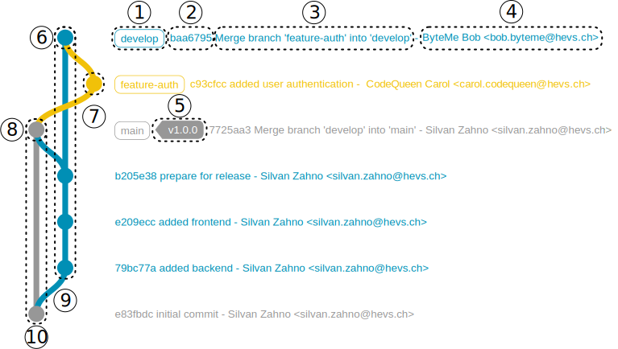

# Answers of <students-firstname> <students-lastname> <github-username>

## Basics
### Task 1
- answers.md
- img folder
    - gitgraph.svg

### Task 2
Avec le 'git status' on observe que le fichier "README.md" n'est pas suivi
Le 'git log --oneline' reste inchangé

### Task 3
Le 'git status' nous indique que le nouveau fichier "README.md" est suivi et que le answers.md est modifié
Le 'git log --oneline' reste inchangé

### Task 4
Le 'git status' nous indique que le fichier "answers.md" et README.md sont modifiés
Le 'git log --oneline' reste inchangé

### Task 5
Le numéro au début de chaque ligne du 'git log --oneline' est l'identifiant du commit
HEAD et main nous signifie sur quelle branche nous sommes
Entre parenthèse c'est le nom de la branche sur laquelle le commit a été fait

### Task 6

## Gitgraph

### Task 7

